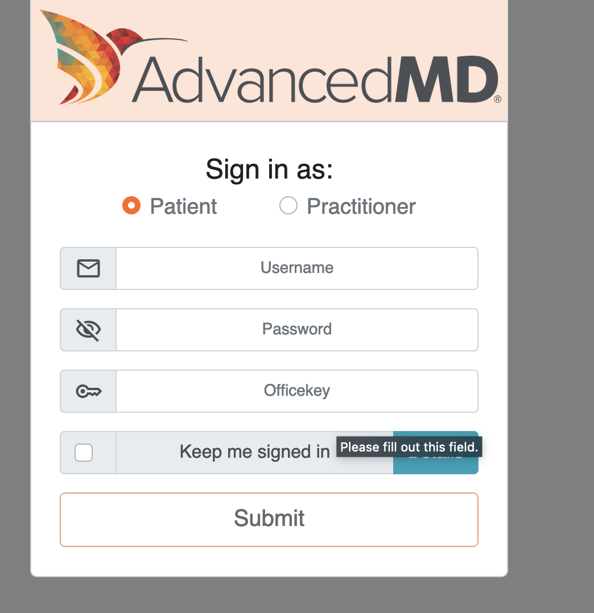

I am the President of Fasten Health, Inc. a Personal Health Record (PHR) application that allows patients to create a longitudinal health record using Patient Access APIs.

I’m submitting an Information Blocking Complaint against:

- **Name:** AdvancedMD  
- **Website:** https://www.advancedmd.com/
- **Role:** Certified Health IT  
- **CHPL Link:**  https://chpl.healthit.gov/#/listing/11406

I’ve been able to successfully to register an application for their development environment, however their APIs are not functional for a number of reasons:

- They will not provide a list of FHIR Endpoints and organization details as required in [45 CFR 170.404(b)(2)](https://www.ecfr.gov/current/title-45/subtitle-A/subchapter-D/part-170#p-170.404(b)(1))
- They require patients to enter a non-standard "officekey" parameter, which they don't provide. This effectively makes their FHIR endpoint unusable.

See attached PDF with our email thread

