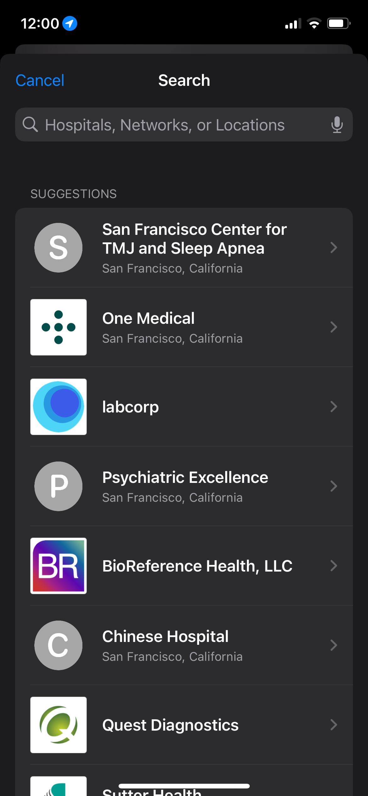
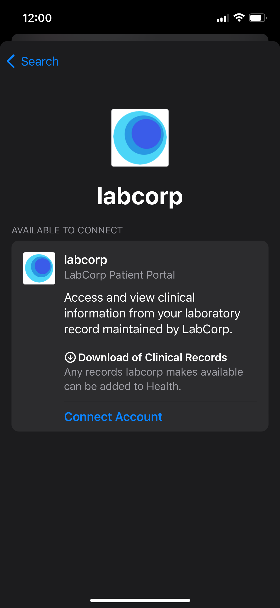
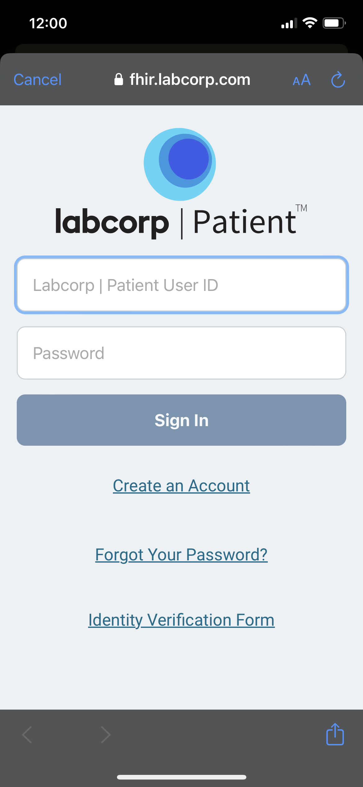

I am the President of Fasten Health, Inc. a Personal Health Record (PHR) application that allows patients to create a longitudinal health record using Patient Access APIs.

I’m submitting an Information Blocking Complaint against:

- **Name**: Labcorp
- **Website**: https://www.labcorp.com/
- **Actor**: Laboratory

I've reached out to LabCorp requesting access to their development environment and FHIR APIs for Patient Access. After a number of emails they responded that "In particular, we provide patients with access to their health data through our patient portal and through other mechanisms in a manner that complies with our legal obligations. The information blocking rules are designed to increase patient access to health data, not to grant rights to third parties, like Fasten Health, to patient data."

I've attached my email correspondence with Labcorp to this complaint.

I would also like to note that Labcorp seems to be implementing access to their API in a discriminatory way. Apple Health has been given permission to access the LabCorp FHIR API endpoints (leveraging Patient Access - via SMART on FHIR). Labcorp also has their own Patient app which seemingly uses their patient access FHIR APIs. 

