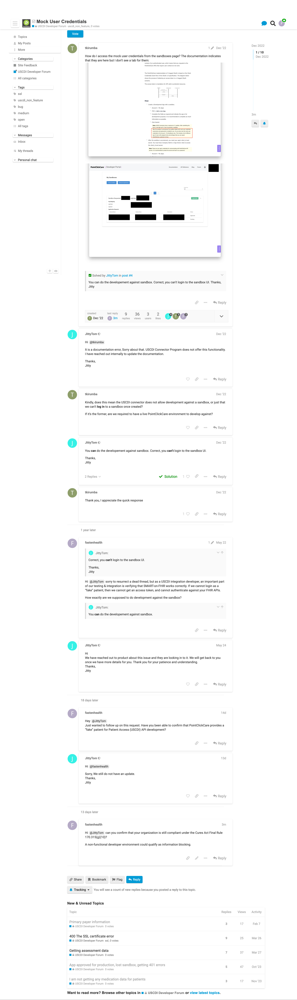

I am the President of Fasten Health, Inc. a Personal Health Record (PHR) application that allows patients to create a longitudinal health record using Patient Access APIs.

I’m submitting an Information Blocking Complaint against:

- **Name:** PointClickCare  
- **Website:** https://pointclickcare.com/
- **Role:** Certified Health IT  
- **CHPL Link:** https://chpl.healthit.gov/#/listing/10246

I’ve registered with the PointClickCare development environment, however they do not provide testing credentials for their sandbox environment, allowing developers to test integrations with their Patient Access APIs.

Timeline:

- May 22, 2024 - messaged Support via forum
- June 16, 2024 - followup via forum
- June 25, 2024 - followup via forum

